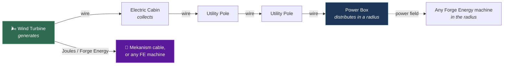

<div align="center">

# ⚡ Electricity

**Real electrical grids for Minecraft.** Utility poles, wind turbines and photovoltaic
plants driven by a live weather model, wires that lose power over distance — and machines
that talk to Mekanism and answer to ComputerCraft.


</div>

> [!NOTE]
> This is a **fork** of [dooji2/electricity](https://github.com/dooji2/electricity).
> The grid simulation, the weather model and the blocks are dooji's work, as are the
> turbine and the electric cabin — the two models everything else here was measured
> against. What this fork adds is everything under [Integrations](#integrations): the
> turbine now feeds other mods' energy networks, reports itself as a ComputerCraft
> peripheral with 63 plant signals, and can be stopped and curtailed; the placeholder
> solar panel has become a photovoltaic plant with arrays, inverters, trackers and a met
> mast; and every other placeable has been redrawn to the turbine's own level of detail,
> with its collision cut from its own geometry.
>
> → [The models, the textures and the hitboxes](docs/model-audit.md)

---

## How a grid works

Power flows along a fixed chain. Wires connect *insulators*, not blocks, so components
can sit far apart — at the cost of losing power over the distance.



The chain is enforced: a turbine only feeds a cabin, a cabin only feeds a pole, a pole
feeds poles or a power box. The branch to Mekanism is what this fork adds.

**Two things about wires.** Power drops with distance — roughly 1% per block of wire.
And running *more* wires between the same two poles preserves it better, so a long run
is worth doubling up.

## Integrations

<table>
<tr><td width="50%" valign="top">

### 🔌 Mekanism & Forge Energy

The turbine exposes its output as **Joules** on its bottom and back faces and pushes to
whatever is adjacent each tick, the same way a Mekanism generator emits. Universal
Cables draw from it directly; any Forge Energy machine works too.

One kW is **125 J/tick**, derived from the mod's own numbers rather than invented: the
Power Box has always run at 50 FE per kW, and Mekanism defaults to 2.5 J per FE.

Nothing is double-spent. Generation opens a per-tick budget, foreign cables claim from
it, and the wire network receives only what is left.

→ [Integrations guide](docs/integrations.md)

</td><td width="50%" valign="top">

### 💻 ComputerCraft

Four peripherals — `electricity_wind_turbine`, `electricity_pv_inverter`,
`electricity_pv_array` and `electricity_met_station` — readable directly or over a
wired modem on network cable.

```lua
local t = peripheral.find("electricity_wind_turbine")
print(t.getActivePower() .. " kW")
print(t.getGearBoxOilTemp() .. " C")
t.setActivePowerLimit(40)   -- curtail
t.stop()                    -- brake

local i = peripheral.find("electricity_pv_inverter")
print(i.isClipping() and "clipping" or "tracking")
```

160 signals modelled on real turbine and plant SCADA tags, each marked measured, derived
or simulated so a program knows what it is allowed to trust — and method names shared with
Mekanism's generators so existing programs work unchanged.

→ [Full API reference](docs/telemetry.md)

</td></tr>
</table>

### 🎛️ Control

Stop, start and curtail a turbine from a computer, or wire it to redstone with
`DISABLED` / `HIGH` / `LOW` modes — the same names Mekanism uses.

A **stop** brakes the rotor and feathers the blades. A **curtailment** just holds output
at a setpoint while the machine keeps turning. The telemetry tells the two apart, and
tells both apart from the machine shutting itself down in a gale.

### 🌪️ Storm control

Above 22 m/s the turbine no longer trips straight to zero. It sheds a fifth of rated per
m/s — 80%, 60%, 40% at 22, 23 and 24 — and brakes at 25. Coming off full load in one
step is a shock to the drivetrain, and no real turbine does it.

→ [Power curve, thresholds and all the numbers](docs/telemetry.md#3-the-catalogue)

## ☀️ Sunlight, split three ways

The light arrives as a **beam**, as **diffuse sky** and as **ground reflection**, and keeping
them apart is what makes a shadow behave. Block the beam under a clear sky and an array loses
91% of what was on its plane; block it under a full overcast and it loses nothing at all,
because there was no beam left to block.

At half cloud cover the total on the ground has barely moved and the split has gone from a
tenth diffuse to a half — which is why a broken sky costs a fixed array almost nothing and
costs a tracker a great deal. A tracker's whole advantage is in the beam.

Glass over a panel passes 88%, leaves 25%, water 50%. Snow buries it, and only an array
tilted past 30° with warm modules can shed it. Dust builds up faster where it never rains,
and rain washes a tilted array clean and a flat one only partly.

→ [All of it, with the numbers](docs/photovoltaics.md#5-where-the-light-comes-from)

## Blocks and items

| | Name | What it does |
|---|---|---|
| 🌬️ | **Wind Turbine** | Six machines from 10 kW to 4 MW, following the real Vestas line. Yaws to follow the wind, pitches its blades above rated, idles through a storm. |
| 🗼 | **Turbine Tower** | Stack it to the height you want, then seat a turbine on top. Hub height is something you build, and it is worth about 3% a block. |
| 📦 | **Electric Cabin** | Collects from generators and passes it to utility poles. Two insulators: **left is output, right is input**. |
| 🗼 | **Utility Pole** | Carries power across distance. Eight insulators, configurable. |
| 🔋 | **Power Box** | Distributes within a radius, and bridges to Forge Energy. |
| 🔧 | **Power Wrench** | Opens a live diagnostics panel on any electric block. |
| 🧵 | **Wire** | Right-click one insulator, then another. |
| ☀️ | **Photovoltaic Arrays** | Six products from a flat 18 kW table to a dual-axis tracker, on four mountings, built from six real module datasheets. Produce nothing without an inverter, because an open-circuit string does not — and not every string fits every inverter's tracking window. |
| 🔌 | **Inverters** | Four machines from 10 kW to 2.5 MW. Clip when the array offers too much, derate when the air is hot, hold a power factor, and draw a watt overnight like the real ones. |
| 📡 | **Meteorological Mast** | Nine instruments: global, diffuse and plane-of-array irradiance, albedo, air and module temperature, wind, and snow. Each answers at its own instrument's speed. |
| 📡 | **Weather Tablet** | Weather intensity map. Not functional yet. |

Components — Circuit Board, CPU, Screen, Insulator, Metal Casing, Motor Core — and every
part above them are made at a normal crafting table. Recipes are visible in-game; use JEI.

## Getting started

1. Craft the components you need at a crafting table: everything in the mod is made at one.
2. Stack **Turbine Towers** to the height you want and seat a **Wind Turbine** on top.
   Each machine is sold on a range of tower heights and refuses to mount outside it.
   Below its cut-in wind — 3 to 4 m/s — it produces nothing. High ground is worth more
   than anything else you can do: a ridge beats three extra blocks of tower.
3. With a **Wire** in hand, right-click the turbine's insulator, then the **right**
   insulator of an **Electric Cabin**.
4. Cabin's **left** insulator → a **Utility Pole** → more poles → the **Power Box**
   (its insulator is underneath).
5. Anything that takes Forge Energy inside the Power Box's radius is now fed.

→ [Step-by-step guide](docs/getting-started.md)

### ☀️ Or build a solar plant

Place an **inverter**, put **arrays** within twelve blocks of it, and run a wire from the
fitting on top of the cabinet to an **Electric Cabin**. An array with no inverter in range
makes nothing at all — an open-circuit string sits at its open-circuit voltage and passes no
current, which is why a plant is an inverter with modules attached rather than the reverse.

Put more glass in front of it than it can pass, because that is what real plant does: the top
of the best few hours gets clipped and in exchange the inverter is loaded properly for the
rest of the year. Tilt or track it if it snows where you are building. A **mast** measures the
sky and tells you which of the six reasons the plant is not making more.

→ [The plant, the physics and the catalogue](docs/photovoltaics.md)

## Configuration

`<world>/serverconfig/Electricity/server.toml` — server configs live inside the world
folder, not in `config/`.

| Key | Default | Meaning |
|---|---|---|
| `powerBoxRadius` | 5 | Radius of the Power Box's field, in blocks |
| `externalEnergyEnabled` | true | Let generators feed other mods' energy systems |
| `turbineExportFraction` | 0.2 | Share of its nameplate a turbine offers to foreign cables |
| `turbineMaxJoulesPerTick` | 0 | Optional hard ceiling on that, in J/t. 0 disables it |
| `pvExportFraction` | 0.2 | The same dial for a photovoltaic inverter |
| `pvMaxJoulesPerTick` | 0 | The same optional ceiling |
| `arraySearchRadius` | 12 | How far an inverter looks for arrays to wire up, in blocks |

The export share is a fraction rather than a fixed number of Joules because the catalogue
spans 10 kW to 4 MW: any absolute cap would either strangle the large machines or hand the
small ones more than they can make. A fifth keeps the ratio the mod shipped with — the
original single turbine made 9844 J/t and was allowed to export 2000 — so an upgrade ladder
still means something across the bridge without a 4 MW machine flattening a modpack's
economy. Whatever is not taken stays on the wire network either way. Raise it to 1.0 to
make generators full-output exporters.

`arraySearchRadius` is 120 metres of DC cable at the mod's ten metres to the block, about
as far as a real plant runs a string before the voltage drop stops being worth it. Raising
it lets a plant spread out; it does **not** let one inverter swallow more arrays, because
each one still refuses them past the number of string terminals it has.

## Building from source

```bash
./gradlew build          # jar lands in build/libs/
./gradlew runClient      # dev client, with Mekanism and CC:Tweaked included
```

Java 17. Mekanism and CC:Tweaked are `compileOnly`, so the mod builds and runs without
either installed — every reference to them is confined to one class each, behind a
`ModList` check.

## Credits and licence

Created by **dooji** — [dooji2/electricity](https://github.com/dooji2/electricity).
Upstream is the origin of the grid simulation, the weather model, the blocks and all the
art. This fork adds the integrations described above.

- **Code** — GNU GPL v3.0 only, see [`LICENSES/LICENSE-CODE`](LICENSES/LICENSE-CODE)
- **Assets** (models, textures, audio) — **All Rights Reserved** to the original author,
  see [`LICENSES/LICENSE-ASSETS`](LICENSES/LICENSE-ASSETS)

> [!IMPORTANT]
> The asset licence is why this fork is not published anywhere. Redistributing it with
> the original models and textures would need dooji's permission, or replacement art.
