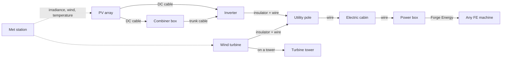
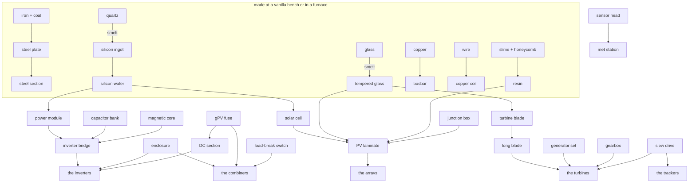

# Everything in the mod, and what it connects to

Written to answer four questions about the whole of it rather than about one machine at a time: does
every item work, does it make sense, is it usable, and does what connects to what match the way a real
plant is put together. The last section is the one that matters most — what is *missing*.

Sixty-nine obtainable things. Every one of them has a recipe, an item model, a sprite and a name, and
`tools/gen_crafting.py` refuses to write a tree where that is not true.

## The two power chains, and where they meet

There are two, and they are separate on purpose because they are separate in reality: direct current on
the array side of an inverter, alternating current after it.

**DC side.** A row is connected when a run of copper meets what it has drawn at one of its two ends: its
socket, which is always there, or its own lead, which exists once a reel of string cable has been worked
in. So the reel is what carries the connection on to the *next* row — a line of six tables off one cable
takes five of them — and the row at the end of the line needs none. From there a run of cable reaches
either a combiner box or an inverter with fused string terminals, and `DcNetwork` follows the copper
rather than a radius while `PvStrings` follows the harnesses, so what a player sees connected is what the
plant counts. Length costs what copper costs: 200 m of
6 mm² at a string's own current is 2.8% lost, and the same strings paralleled into one 240 mm² trunk is
1.0%. That difference is the reason a combiner box exists, and the panel says so.

**AC side.** This is the older half of the mod and it works on insulators and wire: a machine carries
insulators, a wire joins two of them, and `PowerNetwork` solves the graph. A power box turns what
arrives into Forge Energy for anything else in the pack.

**The met station is not in either chain.** It measures and reports — irradiance on three planes, albedo,
air and module temperature, wind, snow — and one mast serves a whole plant.

## What each thing is for

### Tools and instruments

| item | what it does |
|---|---|
| Power Wrench | right-click any machine to read it: nameplate, state, what it is connected to |
| Wire | joins two insulators, which is how the AC side is built |
| Weather Tablet | storms and wind, in the hand |

### Direct current

| item | what it does | connects to |
|---|---|---|
| DC String Cable (6 mm²) | right-click an array to fit its leads; sneak on soil to bury it; anything else lays it like redstone | arrays, combiners, string terminals on inverters |
| DC Trunk Cable (240 mm²) | the home run, and it will not join a string cable — different terminals in reality, one rule here | combiners, busbars on central inverters |
| Combiner Box CB-6 / CB-16 / CB-32 | one gPV fuse per pole per string, a surge arrester and an output load-break switch. Empty hand throws the switch, which takes the group off the machine and leaves the strings live — because they are | strings in, one trunk out; or fitted inside a central inverter |

### The arrays

Six products, one block each, all of them a mounting with modules on it. What differs is what differs in
a real plant: the mounting, and what the modules are.

| array | mounting | notes |
|---|---|---|
| FT-415 (`solar_panel`) | flat ballasted table | the entry-level table, and the registry name the mod started with |
| FT-430 | flat ballasted table | ballast trays, a newer module |
| HT-530 / HN-580 | fixed rack at 25° | the 580 is the large-format module, so it takes a fourth laminate of silicon |
| HN-700 | single-axis tracker | a torque tube and one slew drive; the tube is forced north-south, because that is the only axis a row can follow the sun from |
| HB-440 | dual-axis pedestal | two slew drives, because it has two axes |

### The inverters

| machine | what it is | DC terminals |
|---|---|---|
| VX-10K | a wall string inverter, convection cooled | strings direct into two MPPTs |
| VX-110K | a big string inverter with fans | strings into nine MPPTs |
| VX-350K | the "virtual central" machine | strings *and* trunks — the only one that takes both |
| VC-2500K | a central inverter in a container | busbars only, so it cannot take a string without a combiner |

That last row is a rule and not a limitation: a central inverter has no fused string inputs, which is
precisely why combiner boxes are on the market. The panel names each machine's terminals, because it is
the one thing you cannot see from outside and have to know before laying a metre of cable.

### Wind

| item | what it does |
|---|---|
| Turbine Tower | stack it to the height you want; nothing stands above 16 blocks |
| SW-10 | small wind: a tail vane, no yaw motor, no gearbox |
| C52-0.85 … C130-4.0 | the utility line. The letter is the maker and the number is the rotor in metres, exactly as a real datasheet reads |

A machine refuses to mount outside the range of tower heights it is certified for — both ends, because
the low end is physics: the blades would be in the ground.

### The parts

Thirty-two of them, in three tiers, and none is placeable or usable: they exist to be ingredients.
`PartCatalog` is the list and every entry says what it is for, because for a part nobody can hold to any
purpose that tooltip is the only way to tell what it belongs to.

## Is it coherent? What the pass found

**Every product of one kind shares a recipe spine, and differs where the machines differ.** That was the
requirement and it holds: three laminates over a mounting for every array, bridges over an enclosure for
every inverter, fuse ways over an enclosure for every combiner, three blades over a drivetrain for every
turbine. A reader can see the difference between two machines by laying their recipes side by side, which
is the point.

**No two recipes share a grid.** Checked, because the failure is silent: the game indexes whichever it
read first and the other product simply cannot be made, with nothing in any log.

**Nothing is made and never used.** Also checked. A part that is craftable, useless and undocumented
costs a player an evening.

**Every machine says what it needs.** An array with no leads says so; an array whose collector is out of
reach says so; a combiner fitted to a machine that has its own fused terminals is refused *with the
reason*, which is that a string inverter's terminals are the fusing and a second set would be a fuse in
series with a fuse.

## What is missing, and what I would do about it

These came out of writing the table, and none of them is a bug — they are the gaps.

1. **The two chains meet only at the inverter's AC side, through insulators and wire.** That works, but
   an inverter's AC terminals are not drawn: there is no visible thing on the cabinet where the wire
   lands, the way an array has a junction box. A pair of bushings on the inverter's roof, and the wire
   snapping to them, would close the loop visually. *(The model already has one insulator on the roof —
   it is the obvious place.)*

2. **A combiner cannot feed another combiner.** Real plants do exactly that: string combiners into a
   recombiner. `DcNetwork` stops at machines by design, so this would be a rule change rather than a
   bug fix, but it is the one topology a player will try and be surprised by.

3. **Nothing consumes the met station's measurements except the panels.** The instruments are real, the
   figures are real, and the plant does not read them: an array computes its own irradiance. Wiring the
   mast's plane-of-array reading into a tracker's backtracking decision is the obvious use, and it is
   what a real plant does with it.

4. **The AC side has no transformer.** A 690 V central inverter feeding a pole line directly is the one
   place the mod is less careful than it is everywhere else. A transformer block between the inverter and
   the line, with a real ratio and real copper losses, would make the voltage figures on the panels mean
   something end to end.

5. **The upstream `solar_panel` and `power_box` predate the catalogue.** They work, and they now sit in
   the same crafting tree as everything else, but the power box converts to Forge Energy at a fixed rate
   with no mention of voltage — where every other machine in the mod is careful about it.

6. **No fault state is repairable.** A machine can degrade and de-rate; nothing brings it back. A
   service action with the wrench — clean the modules, replace a blown fuse — would give the wrench a
   second job and the plant a maintenance loop.
